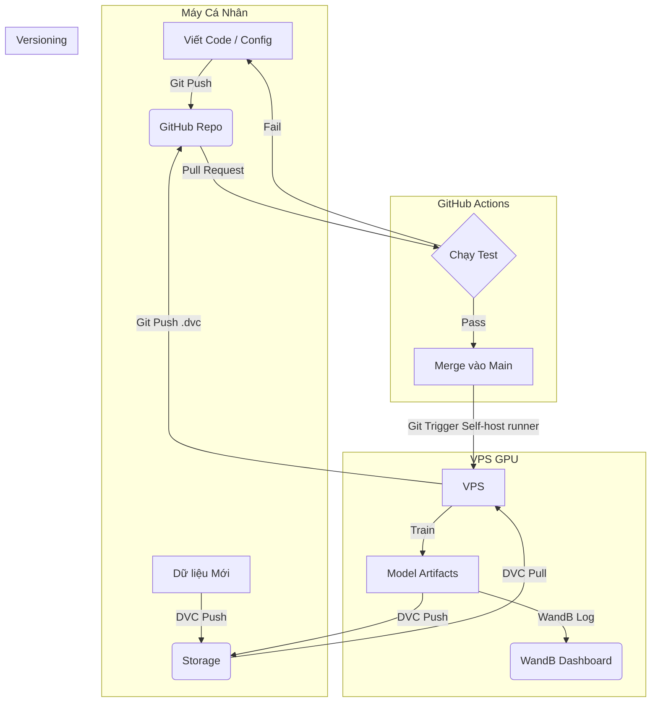

# 🎨 Pix2PixHD MLOps: High-Resolution Image Synthesis Pipeline


> **Dự án xây dựng pipeline MLOps toàn diện cho mô hình Pix2PixHD (High-Definition Image-to-Image Translation), tập trung vào khả năng tái lập (Reproducibility), tự động hóa (Automation) và quy trình Hybrid Training (Local/Cloud).**

---

## 🚀 Giới thiệu (Overview)

Dự án này triển khai thuật toán **Pix2PixHD** (sử dụng *Global Generator* và *Multiscale Discriminator*) để tạo ra hình ảnh độ phân giải cao (ví dụ: chuyển bản đồ ngữ nghĩa thành ảnh thành phố).

Điểm đặc biệt của dự án không nằm ở thuật toán mới, mà ở việc **chuẩn hóa quy trình phát triển theo tiêu chuẩn MLOps**, giải quyết các vấn đề thực tế:
* **Quản lý dữ liệu:** Xử lý versioning cho dữ liệu ảnh lớn bằng DVC.
* **Module hóa:** Tách biệt code nghiên cứu (Notebooks) và code sản phẩm (`src`).
* **Hybrid Training:** Phát triển trên local, huấn luyện trên Google Colab, và quản lý kết quả tập trung.
* **CI/CD:** Tự động kiểm tra lỗi code và tích hợp quy trình đóng gói.

---

## 🛠 Tech Stack

| Thành phần | Công nghệ sử dụng | Mục đích |
| :--- | :--- | :--- |
| **Language** | Python 3.10 | Ngôn ngữ lập trình chính |
| **Core Framework** | PyTorch, PyTorch Lightning | Xây dựng Model, Training Loop và Logging |
| **Data Management** | DVC (Data Version Control) | Quản lý version dữ liệu & Model artifacts |
| **Config Management** | Hydra | Quản lý Hyperparameters linh hoạt (`config.yaml`) |
| **Storage** | Google Drive / S3 | Remote Storage cho DVC |
| **Experiment Tracking** | Weights & Biases (WandB) | Theo dõi Loss, Visualize ảnh sinh ra realtime |
| **CI/CD** | GitHub Actions | Tự động test (Unit/Integration) và Build Docker |
| **Environment** | Docker, Conda | Đóng gói môi trường để tái lập kết quả |
| **Structure** | Cookiecutter Data Science | Cấu trúc thư mục chuẩn |

---

## 📂 Cấu trúc dự án (Project Structure)

Dự án tuân theo chuẩn `cookiecutter-data-science` đã được tùy biến cho Deep Learning:

```
├── LICENSE            <- Open-source license if one is chosen
├── Makefile           <- Makefile with convenience commands like `make data` or `make train`
├── README.md          <- The top-level README for developers using this project.
├── data
│   ├── external       <- Data from third party sources.
│   ├── interim        <- Intermediate data that has been transformed.
│   ├── processed      <- The final, canonical data sets for modeling.
│   └── raw            <- The original, immutable data dump.
│
├── docs               <- A default mkdocs project; see www.mkdocs.org for details
│
├── notebooks          <- Jupyter notebooks. Naming convention is a number (for ordering),
│                         the creator's initials, and a short `-` delimited description, e.g.
│                         `1.0-jqp-initial-data-exploration`.
│
├── pyproject.toml     <- Project configuration file with package metadata for
│                         mlops and configuration for tools like black
│
├── references         <- Data dictionaries, manuals, and all other explanatory materials.
│
├── reports            <- Generated analysis as HTML, PDF, LaTeX, etc.
│   └── figures        <- Generated graphics and figures to be used in reporting
│
├── requirements.txt   <- The requirements file for reproducing the analysis environment, e.g.
│                         generated with `pip freeze > requirements.txt`
│
├── setup.cfg          <- Configuration file for flake8
│
└── mlops   <- Source code for use in this project.
    │
    ├── __init__.py             <- Makes mlops a Python module
    │
    ├── config.py               <- Store useful variables and configuration
    │
    ├── dataset.py              <- Scripts to download or generate data
    │
    ├── features.py             <- Code to create features for modeling
    │
    ├── modeling
    │   ├── __init__.py
    │   ├── predict.py          <- Code to run model inference with trained models
    │   └── train.py            <- Code to train models
    │
    └── plots.py                <- Code to create visualizations
```

--------

## Getting Started

### 1. Cài đặt môi trường
Khuyến khích sử dụng Conda để quản lý Python và CUDA:

```bash
# Clone dự án
git clone [https://github.com/quangzp/pix2pix-mlops.git](https://github.com/quangzp/pix2pix-mlops.git)
cd pix2pix-mlops

# Tạo môi trường ảo
conda create -n pix2pix python=3.10
conda activate pix2pix

# Cài đặt thư viện
pip install -r requirements.txt
```

### 2. Chuẩn bị dữ liệu (DVC)

```bash
# Cấu hình xác thực, storage (nếu cần) và tải dữ liệu + model cũ (nếu có)
dvc pull
```

### 3. Huấn luyện (Training)
Chạy training với cấu hình mặc định hoặc tùy chỉnh qua Hydra mà không cần sửa code:
```bash
# Chạy mặc định (theo conf/config.yaml)
python src/train.py

# Chạy tùy chỉnh (Ví dụ: Train 200 epochs, batch size 4)
python src/train.py train.max_epochs=200 data.batch_size=4

# Chạy với WandB logging (cần login wandb trước)
python src/train.py logger=wandb
```

### 4. Suy luận (Inference)
Sinh ảnh từ model đã train:
```bash
python src/predict.py \
    --ckpt_path models/best_model.ckpt \
    --input_path data/test/sample_input.jpg \
    --output_path results/generated.jpg
```

# 🔄 Quy trình MLOps (Hybrid Workflow)

Tài liệu này mô tả quy trình làm việc chuẩn cho dự án Pix2PixHD, kết hợp giữa môi trường phát triển cục bộ (Local) và huấn luyện trên Cloud (Google Colab) để tối ưu chi phí và hiệu quả.

## 🗺️ Sơ đồ tổng quan



### 📊 Kết quả (Results)

